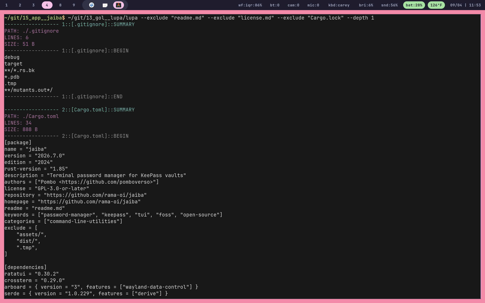

# Lupa

Lupa is a command-line tool for turning a directory into structured context. It recursively walks a project and applies optional filters. Files are wrapped in predictable SUMMARY, BEGIN, and END markers. Binary files are detected and represented as BINARY FILE instead of dumping their contents.



## Flags

```
--depth
```
```
--exclude
```
```
--include
```
```
--no-color
```
```
--summary
```